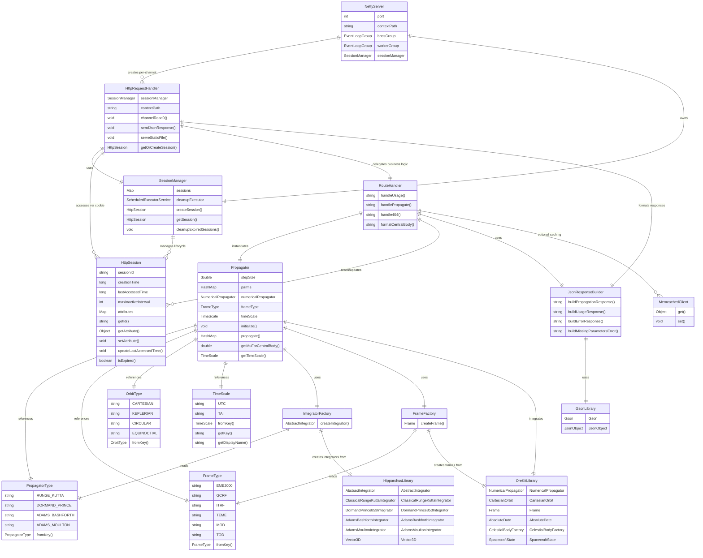
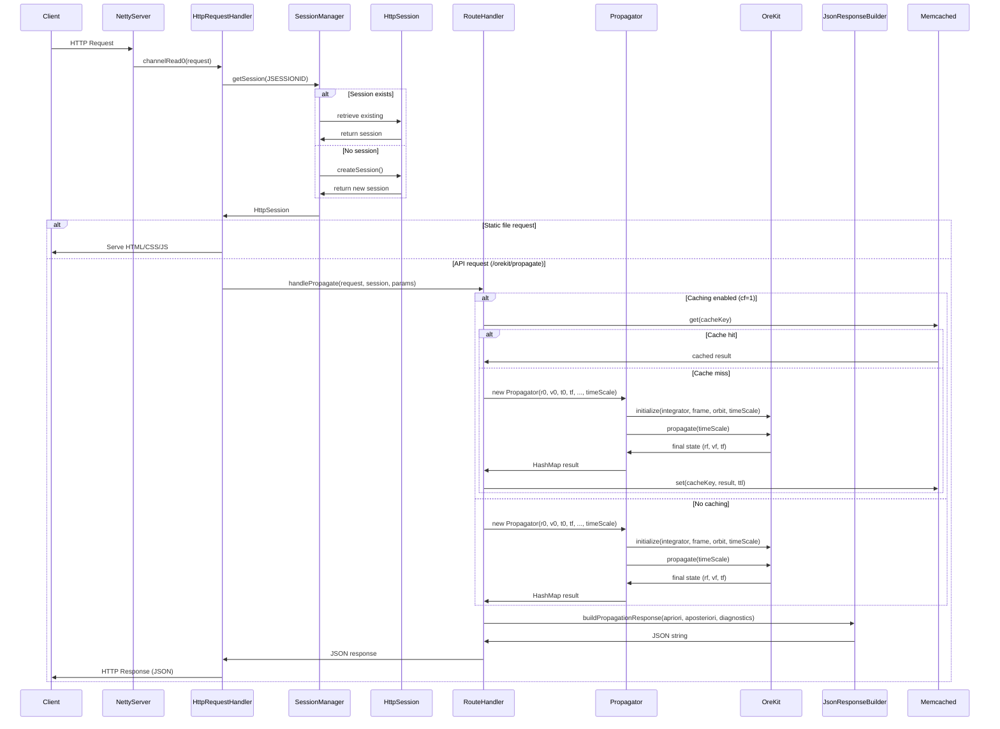
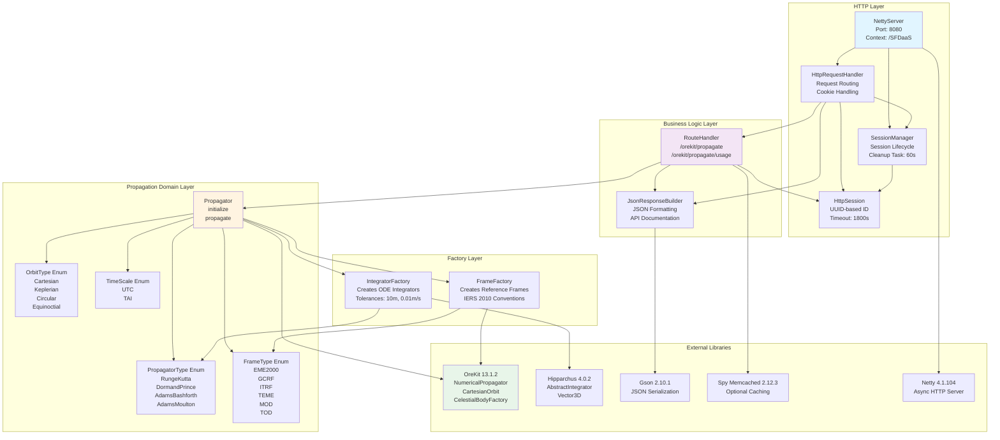
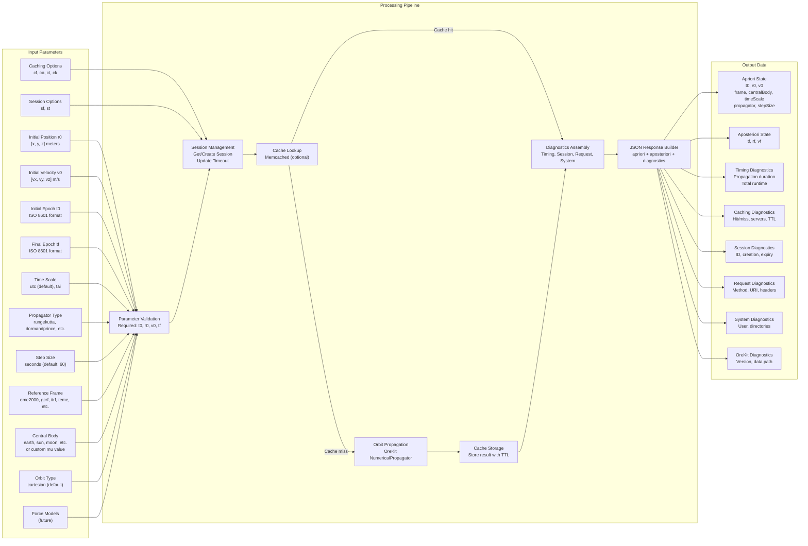

# SFDaaS Entity Relationship Diagram

## System Architecture Overview

This diagram shows the relationships between all entities in the Space Flight Dynamics as a Service (SFDaaS) system.

## Request Flow Diagram

## Component Dependency Diagram

## Data Flow Diagram

## Key Relationships Summary

| Source Entity | Relationship | Target Entity | Cardinality |
|--------------|--------------|---------------|-------------|
| NettyServer | owns | SessionManager | 1:1 |
| NettyServer | creates | HttpRequestHandler | 1:N (per channel) |
| SessionManager | manages | HttpSession | 1:N |
| HttpRequestHandler | uses | SessionManager | N:1 |
| HttpRequestHandler | accesses | HttpSession | N:N |
| HttpRequestHandler | delegates to | RouteHandler | N:1 |
| HttpRequestHandler | formats via | JsonResponseBuilder | N:1 |
| RouteHandler | instantiates | Propagator | N:N |
| RouteHandler | reads/updates | HttpSession | N:N |
| RouteHandler | uses | JsonResponseBuilder | N:1 |
| RouteHandler | optionally uses | MemcachedClient | N:N |
| Propagator | references | PropagatorType | N:1 |
| Propagator | references | FrameType | N:1 |
| Propagator | references | OrbitType | N:1 |
| Propagator | references | TimeScale | N:1 |
| Propagator | uses | IntegratorFactory | N:1 |
| Propagator | uses | FrameFactory | N:1 |
| Propagator | integrates with | OreKitLibrary | N:1 |
| IntegratorFactory | reads | PropagatorType | N:N |
| IntegratorFactory | creates from | HipparchusLibrary | N:1 |
| FrameFactory | reads | FrameType | N:N |
| FrameFactory | creates from | OreKitLibrary | N:1 |
| JsonResponseBuilder | uses | GsonLibrary | N:1 |

## Entity Attributes Detail

### Core Propagation Entities

**Propagator**
- `stepSize: double` - Integration step size in seconds (default: 60)
- `parms: HashMap<String,String>` - Initial state parameters
- `numericalPropagator: NumericalPropagator` - OreKit propagator instance
- `frameType: FrameType` - Reference frame enumeration

**PropagatorType Enum Values**
- `RUNGE_KUTTA` - Classical 4th order fixed-step
- `DORMAND_PRINCE` - 8(5,3) adaptive-step (default)
- `ADAMS_BASHFORTH` - Multi-step variable-step
- `ADAMS_MOULTON` - Multi-step variable-step

**FrameType Enum Values**
- `EME2000` - Earth Mean Equator 2000 (Inertial, default)
- `GCRF` - Geocentric Celestial Reference Frame (IAU 2000)
- `ITRF` - International Terrestrial Reference Frame (Earth-fixed)
- `TEME` - True Equator Mean Equinox (TLE/SGP4 compatible)
- `MOD` - Mean of Date
- `TOD` - True of Date

**OrbitType Enum Values**
- `CARTESIAN` - Position/Velocity vectors (currently implemented)
- `KEPLERIAN` - Classical orbital elements
- `CIRCULAR` - Modified elements for near-circular orbits
- `EQUINOCTIAL` - Non-singular elements

**TimeScale Enum Values**
- `UTC` - Coordinated Universal Time with leap seconds (default)
- `TAI` - International Atomic Time - continuous atomic time without leap seconds

### Web/API Layer Entities

**NettyServer**
- `port: int` - HTTP server port (default: 8080)
- `contextPath: String` - Application context path (default: /SFDaaS)
- `sessionManager: SessionManager` - Session lifecycle manager
- `bossGroup: EventLoopGroup` - Connection acceptor
- `workerGroup: EventLoopGroup` - I/O handler

**HttpSession**
- `sessionId: String` - UUID-based unique identifier
- `creationTime: long` - Session creation timestamp (ms)
- `lastAccessedTime: long` - Last request timestamp (ms)
- `maxInactiveInterval: int` - Session timeout (default: 1800s)
- `attributes: Map<String,Object>` - Session data storage

**SessionManager**
- `sessions: Map<String,HttpSession>` - Active sessions (ConcurrentHashMap)
- `cleanupExecutor: ScheduledExecutorService` - Background cleanup (60s interval)

### API Parameters

**Required Propagation Parameters**

- `t0` - Initial epoch (ISO 8601 format)
- `r0` - Initial position vector [x,y,z] in meters
- `v0` - Initial velocity vector [vx,vy,vz] in m/s
- `tf` - Final epoch (ISO 8601 format)

**Optional Propagation Parameters**

- `propagator` - Integration method (default: dormandprince)
- `stepSize` - Integration step size in seconds (default: 60)
- `frame` - Reference frame (default: eme2000)
- `centralBody` - Central body or custom mu value (default: earth)
- `timeScale` - Time scale for epochs (default: utc)
- `orbitType` - Orbit representation (default: cartesian)
- `forceModels` - Perturbation models (future feature)

**Caching Parameters**

- `cf` - Cache flag (0=disabled, 1=enabled)
- `ca` - Cache server addresses (comma-separated)
- `ct` - Cache TTL in seconds (default: 60)
- `ck` - Custom cache key prefix

**Session Parameters**

- `sf` - Session flag (0=disable, 1=enable)
- `st` - Session timeout in seconds

## Technology Stack

| Layer | Technology | Version | Purpose |
|-------|-----------|---------|---------|
| HTTP Server | Netty | 4.1.104.Final | Async non-blocking HTTP server |
| Session Management | Custom (ConcurrentHashMap) | N/A | In-memory session storage |
| Orbit Propagation | OreKit | 13.1.2 | Space flight dynamics library |
| Numerical Integration | Hipparchus | 4.0.2 | Mathematical library (OreKit dependency) |
| JSON Processing | Gson | 2.10.1 | JSON serialization/deserialization |
| Caching | Spy Memcached | 2.12.3 | Optional distributed caching |
| Build Tool | Maven | 3.x | Dependency management and build |
| Task Runner | Task | 3.x | Development workflow automation |

## File Locations

| Entity | File Path |
|--------|----------|
| NettyServer | `sfdaas-api/src/org/sfdaas/api/netty/NettyServer.java` |
| HttpRequestHandler | `sfdaas-api/src/org/sfdaas/api/netty/HttpRequestHandler.java` |
| SessionManager | `sfdaas-api/src/org/sfdaas/api/netty/SessionManager.java` |
| HttpSession | `sfdaas-api/src/org/sfdaas/api/netty/HttpSession.java` |
| RouteHandler | `sfdaas-api/src/org/sfdaas/api/netty/RouteHandler.java` |
| JsonResponseBuilder | `sfdaas-api/src/org/sfdaas/api/netty/JsonResponseBuilder.java` |
| Propagator | `sfdaas-core/src/org/sfdaas/propagation/Propagator.java` |
| PropagatorType | `sfdaas-core/src/org/sfdaas/propagation/PropagatorType.java` |
| FrameType | `sfdaas-core/src/org/sfdaas/propagation/FrameType.java` |
| OrbitType | `sfdaas-core/src/org/sfdaas/propagation/OrbitType.java` |
| TimeScale | `sfdaas-core/src/org/sfdaas/propagation/TimeScale.java` |
| IntegratorFactory | `sfdaas-core/src/org/sfdaas/propagation/IntegratorFactory.java` |
| FrameFactory | `sfdaas-core/src/org/sfdaas/propagation/FrameFactory.java` |
| UI | `sfdaas-web/src/index.html` |

---

**Generated:** 2026-01-13
**SFDaaS Version:** 1.0.0
**OreKit Version:** 13.1.2
